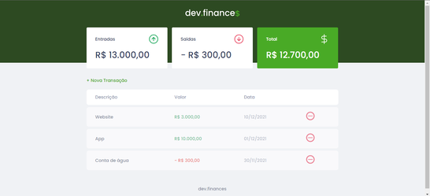
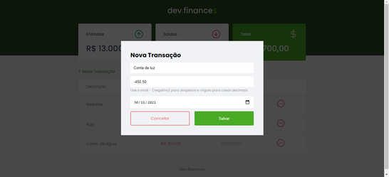
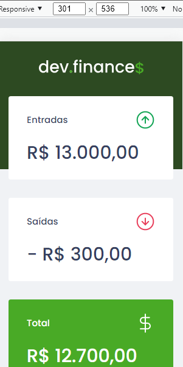
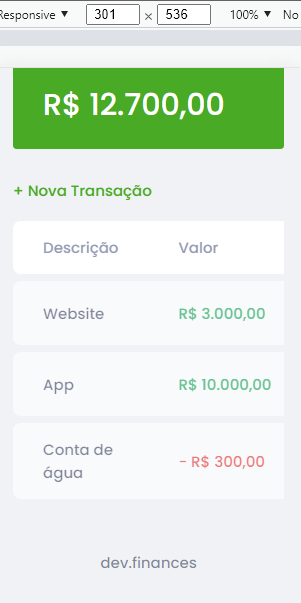
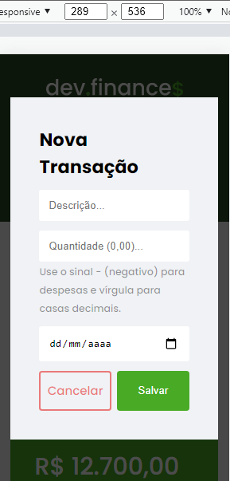

<h1 align='center'>Dev Finances 💰</h1>

Application to manage incomes and expenses

🚀Project Completed✅

    <a href="#-about">• About</a>
    <a href="#-screenshots">• Screenshots</a>
    <a href='#-functionalities'>• Functionalities</a>
    <a href="#-prerequisites">• Prerequisites</a>
    <a href="#-features">• Features</a>
    <a href="#-learnings">• Learnings</a>
    <a href="#-author">• Author</a>
    <a href="#-license">• License</a>

## 💻About

This project is a website that was created to help control and calculate daily earnings and expenses. The project was developed during a [Rocketseat](https://github.com/rocketseat-education) marathon at Discover. To go to the marathon just click on [this link](https://app.rocketseat.com.br/node/maratona-discover-edicao-01).

## 🎨 Screenshots

### Desktop / Laptop

### Mobile 

To see the project hosted on Github Pages click on [this link](https://gustavo-victor.github.io/dev-finances)

## ⚙️ Functionalities

- [x] Modal in JavaScript to display the form

- [x] Income and expense record

- [x] Income and expense exclusion

- [x] Calculation and display of incomes, expenses and total

- [x] Data storage via WebStorage API to keep user data even after page refresh
## 🛠 Features 
### Languages 
- [HTM5L](https://developer.mozilla.org/pt-BR/docs/Web/HTML)
- [CSS3](https://developer.mozilla.org/pt-BR/docs/Web/CSS)
- [JavaScript](https://www.javascript.com/)

### Utilities 
- **Fonts**: [Poppins](https://fonts.google.com/specimen/Poppins?query=Poppins) 
- **API**: [Web Storage API](https://www.w3schools.com/js/js_api_web_storage.asp) 

## 🚀 Prerequisites
To use and contribute to this project you just need basic knowledge of [HTML](https://developer.mozilla.org/pt-BR/docs/Web/HTML), [CSS](https://developer.mozilla.org/pt-BR/docs/Web/CSS), [JavaScript](https://www.javascript.com/) and [Git](https://git-scm.com/) plus a code editor like [Visual Studio Code](https://code.visualstudio.com/).

## 🏅Learnings

During project development, I was able to learn more about responsive design in CSS; but what was new to me was learning about modal in JavaScript and about WebStorage for local storage, which until then I didn't know what it was.

## 🦸 Author

Made with ❤️ by [Gustavo Victor](https://github.com/Gustavo-Victor)

 

## 📝License

This project is under the [MIT license](./LICENSE).

Anyone can use, clone, fork and contribute to this project.

